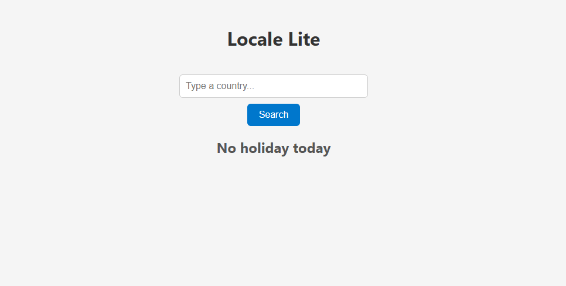
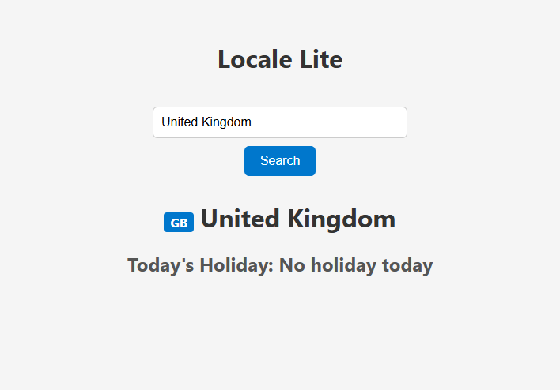

# 🌍 LocaleLite – Local Holiday Checker

LocaleLite is a React-based application that allows users to check if there is a public holiday in a specific country on the current day. Simply enter a country name, and the app will tell you whether there is a holiday today.

🔗 [Live Demo](https://adeelh12.github.io/LocaleLite/)  
📂 [GitHub Repo](https://github.com/AdeelH12/LocaleLite)

---

## ✨ Features

- Check if today is a public holiday in any country.  
- Simple and responsive UI for quick results.  
- Utilizes the [REST Countries API](https://restcountries.com/) for country data.  
- Displays clear, user-friendly messages (e.g., “United Kingdom – Today’s Holiday: No holiday today”).  

---

## 🛠️ Tech Stack

- **Frontend**: React.js  
- **Data Fetching**: `fetch` with `async/await`  
- **API**: [REST Countries API](https://restcountries.com/)  
- **Styling**: CSS3  

---
## 📸 Screenshots

  
  

## 🚀 Getting Started

Clone the repository and install dependencies:

```bash
git clone https://github.com/AdeelH12/LocaleLite.git
cd LocaleLite
npm install
npm start
```

## 🔮 Future Improvements

- Implement localStorage to save recent searches.
- Add autocomplete for country names for better UX.
- Include holiday details (type, description).
- Improve UI/UX with Tailwind CSS or Material UI.

## 📚 What I Learned
- How to fetch and handle data from external APIs in React using async/await.
- Managing state and conditional rendering in React.
- Building a simple, responsive, and interactive web app.
- Structuring a small React project with reusable components.
